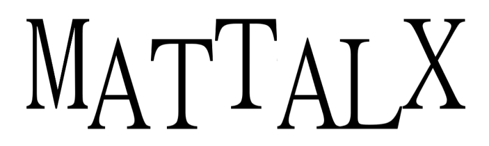

## Versions

MatTalX v3 is under development (current version is v2)

Major improvements/changes:
- Implementation in TypeScript instead of JavaScript
- Parameter popup where you can include a basic header with \documentclass, \usepackage and \renewcommand
- Adequate parser to be able to have more freedom as to what is possible in MatTalX
- Integrated text editor
- And more! (see Contributing)

## Documentation

<a href="https://samueleblanc.com/mattalx/documentation.html" target="_blank">Full documentation</a>

## Presentation from the Chrome webstore and Firefox Add-ons marketplace

Write mathematical expression in UTF format - Convert LaTeX command to text!

With MatTalX (pronounced "Math Talk"), you can convert a simple command, like e^{x} or \alpha into 𝑒ˣ and 𝛼 respectively. They can then be sent via Facebook, Twitter, Instagram, Teams, Gmail and every other online platform.

You can finally talk about physics, mathematics, chemistry and (even) chess with your friends! There is more than 1000 commands! They are quite easy to remember, especially if you are already familiar with LaTeX! If not, simply press Alt+S while writing a command to open the suggestion popup!

Copy and paste " H(t) | \psi(t) \rangle = i \hbar \frac{\partial}{\partial t} | \psi(t) \rangle " in the upper square, click "Convert" and see what happens!

Simple, free and open source!

#### For Chrome

** Shortcuts **

Ctrl+M : Open/Close MatTalX  
Alt+I : Copy the text in the first box (input)  
Alt+O : Copy the text in the second box (output)  
Alt+S : Show suggestions to complete the command

#### For Firefox

** Shortcuts **

Alt+M : Open/Close MatTalX  
Alt+I : Copy the text in the first box (input)  
Alt+O : Copy the text in the second box (output)  
Alt+C : Show suggestions to complete the command

** Documentation **

Full and comprehensive documentation is available if you put your mouse above the question mark (?) on the top right corner of the popup that will appear once you open MatTalX.

## Use MatTalX
Versions:
* <a href="https://samueleblanc.com/mattalx/web-version.html" target="_blank">Web</a>
* <a href="https://chrome.google.com/webstore/detail/mattalx-write-math-symbol/jllceliamggkpffccbefpefgmcigaglb" target="_blank">Chrome</a>
* <a href="https://addons.mozilla.org/firefox/addon/mattalx-write-math-symbols/" target="_blank">Firefox</a>

## Contributing
Thank you for considering to help out! Pull requests and issues are welcomed!

More info [here](CONTRIBUTING.md).

## Testing
A basic test can be ran with `bash build.sh test`

For a full test, it's recommended to build the extension or add-on (`bash build.sh chrome` or `bash build.sh firefox` respectively) and then test it in the browser.

Links for testing in the browser:  
* chrome://extensions/
* about:debugging#/runtime/this-firefox

## License
MIT