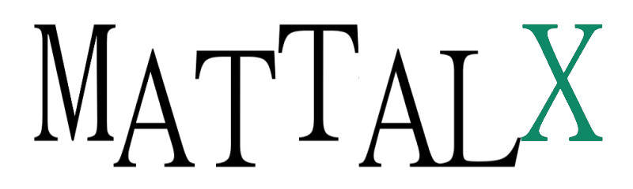

Type LaTeX where you are already typing. Press Alt+Shift+W. Get Unicode maths.

MatTalX turns LaTeX commands into real Unicode characters, inside the text box you are writing in — an email, a message, a post, a comment. There is no popup to open and no symbol to hunt down on another website.

- \alpha         →   𝛼
- x_n \to 0      →   𝑥ₙ → 0
- \mathbb{R}^n   →   ℝⁿ
- A \subseteq B  →   𝐴 ⊆ 𝐵

Because the answer is ordinary text, it goes wherever text goes. It can be searched, selected, quoted, forwarded and read aloud by a screen reader. It is not a picture of an equation.

**Writing with MatTalX**

Press Alt+Shift+W in any text field and what you have written is converted where it sits. Select part of it first and only that part is converted.

Cannot remember a command? Write a piece of it and press Alt+Shift+C. Typing "\arrow" brings up all 67 arrows MatTalX knows, each shown beside the character it gives — \rightarrow: →, \hookrightarrow: ↪, \Longrightarrow: ⟹. Arrow keys to move, Enter to take one. It works in the page and in the popup, the same way in both.

An ordinary sentence stays an ordinary sentence: the maths goes between \$ ... \$, \\( ... \\) or \\[ ... \\]. Prefer to convert everything? Turn on Math mode.


**Make it yours**

\newcommand, \renewcommand, \DeclareMathOperator and \DeclareUnicodeCharacter all work, so \RR can be your ℝ and \Aut your operator. Commands you define are suggested next to the ones MatTalX ships with.


**What you get**

- More than 650 commands, the LaTeX ones you already know
- Suggestions as you type, in the page or in the popup
- Your own commands and operators
- Greek, blackboard bold, script, fraktur, bold, sans serif, superscripts, subscripts, arrows, accents, matrices, and many math symbols
- Free and open source under the MIT licence

**Where it works**

In ordinary text boxes — Gmail, Outlook, Stack Exchange, GitHub, comment forms — the text is converted where you typed it.

Some editors keep their own copy of what you write and refuse to be written into by anything but themselves. X, Discord, Messenger, Slack and Reddit are the common ones. There MatTalX puts the converted text on your clipboard and leaves what it replaces selected, so a single Ctrl+V finishes the job.


**Privacy**

MatTalX reads the field you are writing in, on the tab you are looking at, and only after you press one of its shortcuts. The conversion happens on your own computer. Nothing is uploaded, nothing is collected, there is no account and there are no analytics.


## Use MatTalX
Versions:
* <a href="https://chrome.google.com/webstore/detail/mattalx-write-math-symbol/jllceliamggkpffccbefpefgmcigaglb" target="_blank">Chrome</a>
* <a href="https://addons.mozilla.org/firefox/addon/mattalx-latex-unicode-math/" target="_blank">Firefox</a>
* <a href="https://mattalx.org/web-version/">Web version</a>

## Documentation

Full documentation available <a href="https://mattalx.org/docs/" target="_blank">here</a>.

## Contributing
Thank you for considering to help out! Pull requests and issues are welcomed!

More info [here](CONTRIBUTING.md).

## Code

The conversion itself lives in `common/core.js`, which knows nothing about the DOM. `common/popup.js` is the interface around it.

## Testing

```
npm test          # the conversion cases
npm run test:all  # same, plus every command against the snapshot
npm run bench     # how fast a sentence is converted
```

`npm run snapshot` rewrites `test/snapshot.json` after a deliberate change to the conversion; read the diff before committing it.

`bash test.sh liveserver` opens MatTalX on localhost. For a more complete test, we recommend building the extension or add-on (`bash build.sh chrome` or `bash build.sh firefox` respectively) to test it in the browser.

Links for testing in the browser:  
* chrome://extensions/
* about:debugging#/runtime/this-firefox

## License
MIT